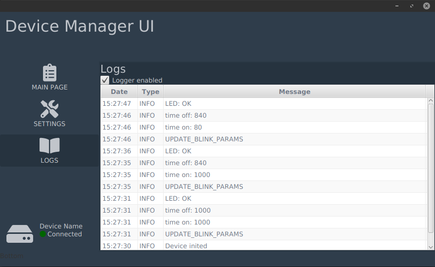

= Device Manager

== Overview

This project describes the architecture and concept of a device management application.
The purpose of the application is to monitor the status of connected device, make backups, change configuration.
The application automatically scans the devices connected to the USB.
When a compatible device is connected, two-way communication begins.

.Fragment of the UI -- device disconnected

.Fragment of the UI -- device connected

== Application structure

The project was created with modularity in mind, so that parts of the application can be reused and extended without having to duplicate or modify existing code.
The following module groups were used: *App*, *Message* and *Core*.

=== App group

This group contains all end user applications.
Each application is dedicated for specified users, for example:

- app-client -- used by people who bought the device, it can be downloaded on the website, with risk of reverse engineering.
- app-production -- only for production PCs, the ability to update / perform self-tests of the device in the simplified / automated way.
- app-service -- for R&D and service guys, allows for full control over device.

.App Client -- logs view

=== Message group

In this project, _Message_ means the data structure used to communicate with the device.
When communicating a _Message_ is really a block of bytes, the most important thing is to have a strategy to deserialize it into an understandable format (for Java and C code).
So, each _Message_ type is defined by:

* Unique message id -- used to identify the type of message and then recognize the message fields.
* Message fields -- fields that the message contains.

To simplify the development process, each message type is defined by an individual java `record` with the `@Message` annotation.
The record components define the fields in the message.

Why Java records?

* Standardized and simple to define
* Forced to be immutable (all fields `final`)
* By default record has a single constructor with all fields -- it's easy to create an object with reflection

Have a look at the message used to update the device LED parameters -- _UpdateBlinkParams_.
The message id has the value `0x33`, this value is known to both the application and the device.
The message transports information about the on and off time of the diode in fields `timeOn` and `timeOff`.

.UpdateBlinkParams.java
[source,java]
----
package mk.dm.message.client;

import mk.dm.core.message.annotation.Message;
import mk.dm.core.message.annotation.Message.Sender;

@Message(messageId = 0x33, sender = Sender.HOST)
public record UpdateBlinkParams(int timeOn, int timeOff) {

}
----

The above record object can be serialized to the byte structure shown below.
As you can see binary data is short as possible, no redundant data.

[ditaa]
----
UpdateBlinkParams message:
+---------+----------+---------+
| 2 bytes | 4 bytes  | 4 bytes |
+---------+----------+---------+
    ^          ^          ^
    |          |          |
MESSAGE ID  'timeOn'   'timeOff'
 (0x33)      FIELD      FIELD
----

Message definitions have been separated into several modules in order to group them by permission level.
So, in the final app we'll have the following modules:

* message-client -- describes minimal communication messages
* message-production -- extra messages used in production
* message-service -- extra messages for service

Of course, the device must support messages from all of these modules.

=== Core group

The basic mechanisms have been placed in modules named with the prefix core-*.

==== core-message

Module contains:

* Interfaces and annotations to define custom message types.
* Logic for (de)serializing fields, with possibility to define custom field serializers (for example for custom field types).
* Logic for (de)serializing messages using field serializers

Additionally, the framework supports record component annotations to serialize fields in the different ways.
For example, it is possible to serialize a string as a fixed-length ASCII string and a variable-length ASCII string:

[source,java]
----
package mk.dm.message.client;

import mk.dm.core.message.annotation.Message;
import mk.dm.core.message.annotation.Message.Sender;
import mk.dm.core.message.annotation.FixedAsciiString;
import mk.dm.core.message.annotation.VarAsciiString;

@Message(messageId = 0x1234, sender = Sender.HOST)
public record Test(
    @FixedAsciiString(length = 10) String fixedLengthString,
    @VarAsciiString String variousLengthString) {

}
----

In this example, the _fixedLengthString_ field will always be serialized with 10 bytes.
When the _fixedLengthString_ string is longer than 10 chars it'll be truncated, when shorter than 10 chars it'll be padded with `\0`.

.Behaviour of @FixedAsciiString(length = 10)
[ditaa]
----
Input
 "12345abcde"
Output
 +------+------+------+------+------+------+------+------+------+------+
 | 0x31 | 0x32 | 0x33 | 0x34 | 0x35 | 0x61 | 0x62 | 0x63 | 0x64 | 0x65 |
 +------+------+------+------+------+------+------+------+------+------+
   '1'    '2'    '3'    '4'    '5'    'a'    'b'    'c'    'd'    'e'

Input
 "12345abcdeABCDEF"
Output
 +------+------+------+------+------+------+------+------+------+------+
 | 0x31 | 0x32 | 0x33 | 0x34 | 0x35 | 0x61 | 0x62 | 0x63 | 0x64 | 0x65 |
 +------+------+------+------+------+------+------+------+------+------+
   '1'    '2'    '3'    '4'    '5'    'a'    'b'    'c'    'd'    'e'

Input
 "12345"
Output
 +------+------+------+------+------+------+------+------+------+------+
 | 0x31 | 0x32 | 0x33 | 0x34 | 0x35 | 0x00 | 0x00 | 0x00 | 0x00 | 0x00 |
 +------+------+------+------+------+------+------+------+------+------+
   '1'    '2'    '3'    '4'    '5'    pad    pad    pad    pad    pad
----

.Behaviour of @VarAsciiString
[ditaa]
----
Input
 "123abc"
Output
 +------+------+------+------+------+------+------+------+------+------+
 | 0x00 | 0x00 | 0x00 | 0x06 | 0x31 | 0x32 | 0x33 | 0x61 | 0x62 | 0x63 |
 +------+------+------+------+------+------+------+------+------+------+
  \_________________________/  '1'    '2'    '3'    'a'    'b'    'c'
      string length value
----

With custom field serializers we could create extra annotations like `@NullTerminatedAsciiString` or `@UTF16String` and assign custom field serializers to them.

==== core-communication-serial

The module wraps the logic used to discover serial port devices and communicate with them.
A single communication structure of data sent in transmission is called frame.
The structure of the data transmitted in the frame is (TODO: should be) as follows:

.Frame structure TODO
[ditaa]
----
Frame structure:
+--------+---------+-------------+---------+--------+
| 1 byte | 4 bytes |             | 4 bytes | 1 byte |
+--------+---------+-------------+---------+--------+
    ^        ^            ^          ^         ^
    |        |            |          |         |
  START    FRAME       MESSAGE      CRC      STOP
  BYTE     LENGTH       BYTES                BYTE
----

===== Device -> Host transmission

The example messages send from the device to the host.

- ErrorLog(string) -- device emits logger error message
- InfoLog(string) -- device emits logger info message

===== Host -> Device transmission

The example messages send from the host to the device.

- EnableLogger(boolean) -- enable debug mode on the device, when enabled it started to emit logger messages
- UpdateBlinkParams(int, int) -- update board LED blink times, just for test

== Arduino UNO Firmware

A sample implementation of the device was prepared using Arduino UNO.
The source code of PlatformIO project is located in the _arduino_fw_ directory.

== Technical Info

What's used

- Guice
- Gradle + VERSION_CATALOGS
- TestNG
- JDK16
- jpackage -- to produce final .deb and .exe files
- JavaFX + FXML
- records -- used to represent messages
- base Jenkinsfile -- with https://hub.docker.com/layers/amd64/openjdk/[openjdk:16.0.1-jdk-buster]

== TODO

It's a demo project, in the final version I'll need:

- move *core** modules into separated repo
- move *message** modules into separated repo
- deploy libs to Nexus
- enrich communication frames with: frame start byte, frame length, frame stop byte, CRC
- make communication with the device authorized, TOTP?
- use jfoenix / create pretty CSS
- i18n
